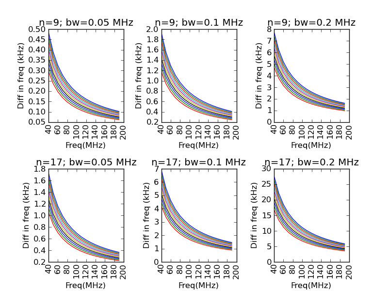
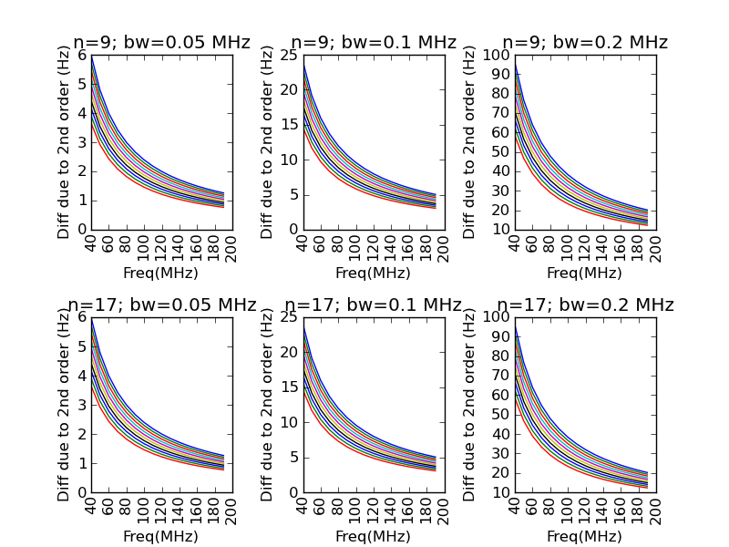

.. _algorithms:

Determining whether an image is confused
----------------------------------------
The number of beams per source (if not set with the :term:`bmpersrc_th` parameter) is calculated by assuming the number of sources in the
image, :math:`N_s`, as:

.. math::

    N_s = (\text{No. pixels} > 5\sigma)/(<\text{pix/src}>),
 
where the average number of pixels per source, :math:`<pix/src>`, is given by:

.. math::

    2\pi \sigma_{\text{major}} \sigma_{\text{minor}} \times (\ln(S_{\text{min}}/5\sigma) - 1/(\alpha - 1)),

where :math:`\alpha` is the slope of the differential source counts taken from Katgert et al. (1988) [#f1]_. Assuming
a minimum of one pixel to define a source and ignoring the effect of noise for sources close to
the threshold, we can ignore the logarithmic term and hence :math:`\text{bmpersrc\_th} = (n\times m)/(\text{No. pixels} > 5\sigma)/(\alpha-1))`. The value of :term:`bmpersrc_th` is used to decide whether
the image is expected to be confused (and if so, the mean image is taken to be zero) and also
to estimate the box size for calculating the rms image (see below).

Calculation of mean and rms maps
--------------------------------
The box size and step size for calculating the rms image are estimated as follows (if not set by the :term:`rms_box` parameter).
Typical intersource seperation, :math:`s_1`, is :math:`2\sqrt{\text{bmpersrc\_th}} \times B_{\text{major}}`.
The size of brightest source, :math:`s_{\text{max}}`, is :math:`2 B_{\text{major}} \times \sqrt{[2\ln(Max_{\text{flux}}/threshold)]}`. Lastly, the maximum dimension of the largest island, :math:`s_{\text{isl}}`, defined at 10--20 sigma above the clipped rms is also found.
The box size is estimated as the larger of the quantities :math:`s_1`, :math:`s_{\text{max}}`, and :math:`s_{\text{isl}}`. The step size is then calculated as the minimum of a third of the box size and a tenth of the smallest image dimension. These prescriptions yield
reasonable numbers for the images tested.

Either the calculated rms image or a constant rms is used for subsequent analysis based on
whether the dispersion in the rms image is consistent with, or is higher than, the expected
statistics. Hence if the dispersion of the rms image is higher than 1.1 times the (clipped) rms of
the image times the inverse of :math:`\sqrt{2} \times Boxsize_{\text{pixels}}` then the rms image is taken. Otherwise, the constant
value of the clipped rms is used.

Gaussian fitting
----------------
The current procedure for calculating the number of Gaussians to be fit simultaneously to an
island is as follows. First, the number of Gaussians is identified with the number of distinct
peaks (higher than the pixel threshold) of emission inside the island (negative gradient in all 8
directions). These peaks are CLEANed from the subimage assuming the theoretical beam. If
the (unclipped) rms of the residual subimage is greater than the (clipped) rms in the region,
the maximum pixel in the residue is greater than the threshold for this former rms, and is
located at least 0.5 beams (and :math:`\sqrt{5}` pixels) away from all previous peaks, then this residual
peak is identified as a new one.

.. _grouping:

Grouping of Gaussians into sources
----------------------------------
Inside each island, groups of Gaussians are deemed to be a part of the same source if:

    1. no pixel on the line joining the centers of any pair of Gaussians has a (Gaussian-reconstructed) value less than the island threshold, and 
    2. the centers are separated by a distance less than half the sum of their FWHMs along the line joining them. 

Once the Gaussians that belong to a source are identified, fluxes for the grouped Gaussians are summed to obtain the total flux of the source. The uncertainty on the total flux is calculated by summing the uncertainties on the total fluxes of the individual Gaussians in quadrature. The source RA and Dec position is set to the source centroid determined from moment analysis (the position of the maximum of the source is also calculated). The total source size is also measured using moment analysis (see http://en.wikipedia.org/wiki/Image_moment for an overview of moment analysis).

.. _colorcorrections:

Effect of neglecting color corrections
--------------------------------------
No color correction is performed when averaging channels. However, as is shown below, errors in the derived parameters are generally small unless the averaged bandwidth is large.

   The correction in frequency in kHz as a function of the frequency resulting from averaging *n* channels each of bandwidth *bw*, for sources with various spectral indices :math:`-1.3 < \alpha < -0.3`.

   The error induced in the frequency by not including the 2nd order term, due to the colour correction of an individual channel, in Hz.

.. figure:: colourcorr_delta_spin.png
   :scale: 80 %
   :figwidth: 75 %
   :align: center
   :alt: color correction errors

   The fractional error made in the spectral index while calculating with the incorrect frequency, with a second frequency which is 10 MHz different.

.. [#f1] Katgert, P., Oort, M. J. A., & Windhorst, R. A. 1988, A&A, 195, 21 
