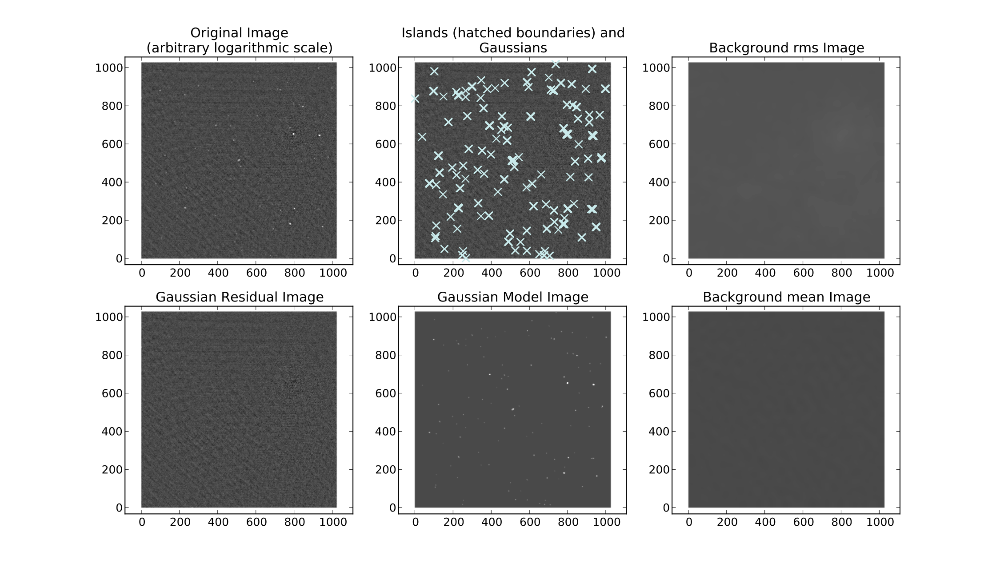
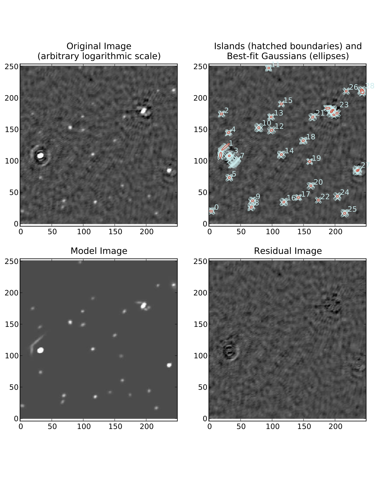
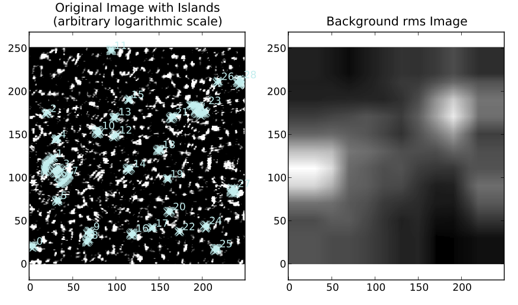
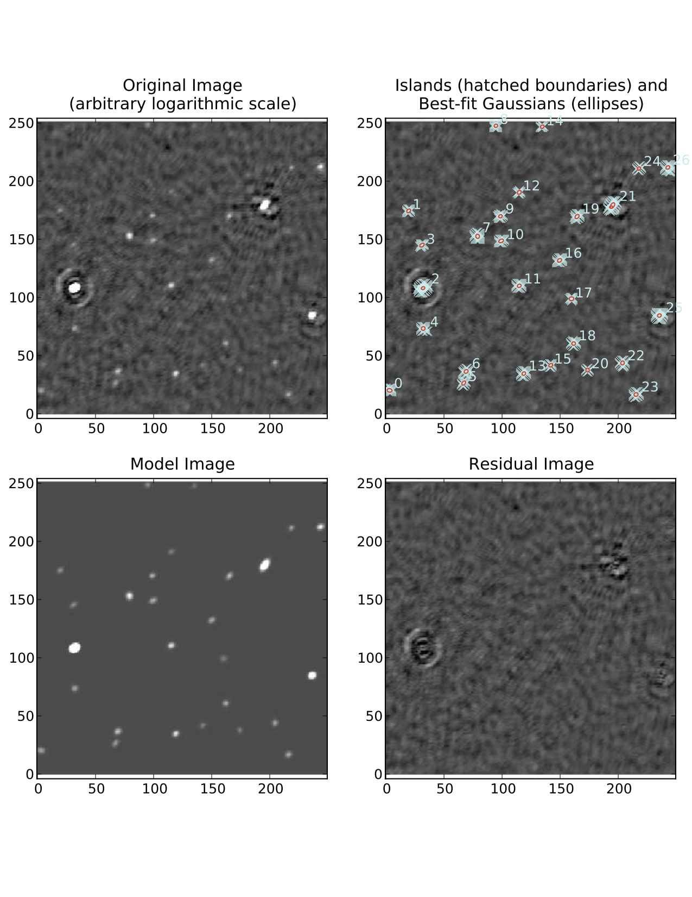
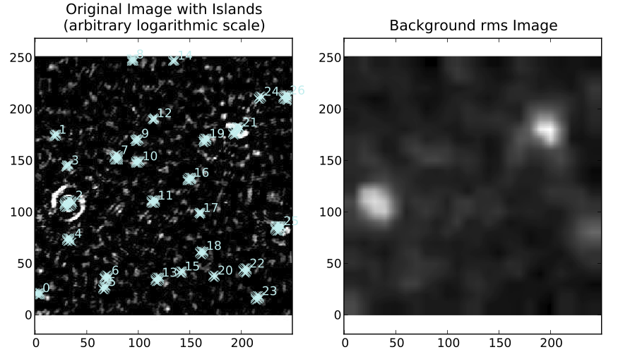
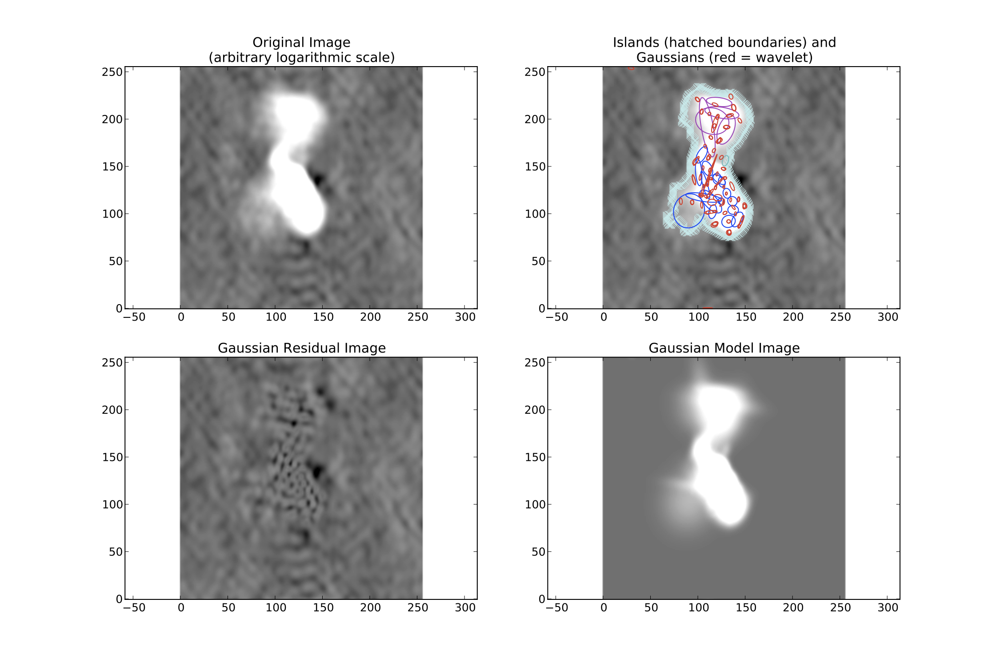

.. _simple_example:

Simple image with point sources
-------------------------------
Below is an example of running PyBDSM on an image composed primarily of point sources (a VLSS image).

::

    $ pybdsm
    
    PyBDSM version 1.1 (LOFAR revision 20883)
    ========================================================================
    PyBDSM commands
      inp task ............ : Set current task and list parameters
      par = val ........... : Set a parameter (par = '' sets it to default)
                              Autocomplete (with TAB) works for par and val
      go .................. : Run the current task
      default ............. : Set current task parameters to default values
      tput ................ : Save parameter values
      tget ................ : Load parameter values
    PyBDSM tasks
      process_image ....... : Process an image: find sources, etc.
      show_fit ............ : Show the results of a fit
      write_catalog ....... : Write out list of sources to a file
      export_image ........ : Write residual/model/rms/mean image to a file
    PyBDSM help
      help command/task ... : Get help on a command or task
                              (e.g., help process_image)
      help 'par' .......... : Get help on a parameter (e.g., help 'rms_box')
      help changelog ...... : See list of recent changes
    ________________________________________________________________________
    

    BDSM [1]: filename='VLSS.fits'
    
.. note::

    When PyBDSM starts up, the ``process_image`` task is automatically set to be the current task, so one does not need to set it with ``inp process_image``.
    
::

    BDSM [2]: frequency=74e6
    
.. note::

    For this image, no frequency information was present in the image header, so the frequency must be specified manually.
    
::

    BDSM [3]: interactive=T
    
.. note::

    It is often advisable to use the interactive mode when processing an image for the first time. This mode will display the islands that PyBDSM has found before proceeding to fitting, allowing the user to check that they are reasonable.
            
::

    BDSM [4]: go
    ---------> go()
    --> Opened 'VLSS.fits'
    Image size .............................. : (1024, 1024) pixels
    Number of channels ...................... : 1
    Number of Stokes parameters ............. : 1
    Beam shape (major, minor, pos angle) .... : (0.02222, 0.02222, 0.0) degrees
    Frequency of image ...................... : 74.000 MHz
    Number of blank pixels .................. : 0 (0.0%)
    Flux from sum of (non-blank) pixels ..... : 177.465 Jy
    Derived rms_box (box size, step size) ... : (196, 65) pixels
    --> Variation in rms image significant
    --> Using 2D map for background rms
    --> Variation in mean image significant
    --> Using 2D map for background mean
    Min/max values of background rms map .... : (0.06305, 0.16508) Jy/beam
    Min/max values of background mean map ... : (-0.01967, 0.01714) Jy/beam
    --> Expected 5-sigma-clipped false detection rate < fdr_ratio
    --> Using sigma-clipping thresholding
    Minimum number of pixels per island ..... : 5
    Number of islands found ................. : 115
    --> Displaying islands and rms image...
    ========================================================================
    NOTE -- With the mouse pointer in plot window:
      Press "i" ........ : Get integrated fluxes and mean rms values
                           for the visible portion of the image
      Press "m" ........ : Change min and max scaling values
      Press "n" ........ : Show / hide island IDs
      Press "0" ........ : Reset scaling to default
      Click Gaussian ... : Print Gaussian and source IDs (zoom_rect mode, 
                           toggled with the "zoom" button and indicated in 
                           the lower right corner, must be off)
    ________________________________________________________________________
    
.. note::

    At this point, because ``interactive=True``, PyBDSM plots the islands. Once the plot window is closed, PyBDSM prompts the user to continue or to quit fitting:

::

    Press enter to continue or 'q' to quit .. : 
    Fitting islands with Gaussians .......... : [==========================================] 115/115
    Total number of Gaussians fit to image .. : 147
    Total flux in model ..................... : 211.800 Jy
    Number of sources formed from Gaussians   : 117
    

The ``process_image`` task has now finished. PyBDSM estimated a reasonable value for the ``rms_box`` parameter and determined that 2-D rms and mean maps were required to model the background of the image. Straightforward island thresholding at the 5-sigma level was used, and the minimum island size was set at 5 pixels. In total 115 islands were found, and 147 Gaussians were fit to these islands. These 147 Gaussians were then grouped into 117 sources. To check the fit, call the ``show_fit`` task:

::

    BDSM [5]: show_fit
    ---------> show_fit()
    ========================================================================
    NOTE -- With the mouse pointer in plot window:
      Press "i" ........ : Get integrated fluxes and mean rms values
                           for the visible portion of the image
      Press "m" ........ : Change min and max scaling values
      Press "n" ........ : Show / hide island IDs
      Press "0" ........ : Reset scaling to default
      Click Gaussian ... : Print Gaussian and source IDs (zoom_rect mode, 
                           toggled with the "zoom" button and indicated in 
                           the lower right corner, must be off)
    ________________________________________________________________________

The ``show_fit`` task produces the figure below. It is clear that the fit worked well and all significant sources were identified and modeled successfully.

   Example fit with default parameters of an image with mostly point sources.

Lastly, the plot window is closed, and the source catalog is written out to an ASCII file with the ``write_catalog`` task:

::

    BDSM [6]: inp write_catalog
    --------> inp(write_catalog)
    WRITE_CATALOG: Write the Gaussian, source, or shapelet list to a file.
    ================================================================================
    outfile ............... None : Output file name. None => file is named     
                                   automatically                               
    bbs_patches ........... None : For BBS format, type of patch to use: None => no
                                   patches. 'single' => all Gaussians in one patch.
                                   'gaussian' => each Gaussian gets its own patch.
                                   'source' => all Gaussians belonging to a single
                                   source are grouped into one patch           
    catalog_type ......... 'gaul': Type of catalog to write:  'gaul' - Gaussian
                                   list, 'srl' - source list (formed by grouping
                                   Gaussians), 'shap' - shapelet list          
    clobber .............. False : Overwrite existing file?                    
    format ................ 'bbs': Format of output catalog: 'bbs', 'ds9', 'fits',
                                   'star', 'kvis', or 'ascii'                  
    srcroot ............... None : Root name for entries in the output catalog. None
                                   => use image file name                      
    
    BDSM [7]: catalog_type='srl'
    
    BDSM [8]: format='ascii'
    
    BDSM [9]: go
    ---------> go()
    --> Wrote ASCII file 'VLSS.fits.pybdsm.srl'

Image with artifacts
--------------------
Occasionally, an analysis run with the default parameters does not produce good results. For example, if there are significant deconvolution artifacts in the image, the ``thresh_isl``, ``thresh_pix``, or ``rms_box`` parameters might need to be changed to prevent PyBDSM from fitting Gaussians to such artifacts. An example of running PyBDSM with the default parameters on such an image is shown in the figures below. 

   Example fit with default parameters of an image with strong artifacts around bright sources. A number of artifacts near the bright sources are incorrectly identified as real sources.

   The background rms map for the same region (produced using ``show_fit``) is shown in the lower panel: the rms varies fairly slowly across the image, whereas ideally it would increase strongly near the bright sources (reflecting the increased rms in those regions due to the artifacts).

It is clear that a number of spurious sources are being detected. Simply raising the threshold for island detection (using the ``thresh_pix`` parameter) would remove these sources but would also remove many real but faint sources in regions of low rms. Instead, by setting the ``rms_box`` parameter to better match the typical scale over which the artifacts vary significantly, one obtains much better results. In this example, the scale of the regions affected by artifacts is approximately 20 pixels, whereas PyBDSM used a ``rms_box`` of 63 pixels when run with the default parameters, resulting in an rms map that is over-smoothed. Therefore, one should set ``rms_box=(20,10)`` so that the rms map is computed using a box of 20 pixels in size with a step size of 10 pixels (i.e., the box is moved across the image in 10-pixel steps). See the figures below for a summary of the results of this call.

   Results of the fit with ``rms_box=(20,10)``. Both bright and faint sources are recovered properly.

   The rms map produced with ``rms_box=(20,10)``. The rms map now varies on scales similar to that of the regions affected by the artifacts.

Image with extended emission
----------------------------
If there is extended emission that fills a significant portion of the image, the background rms map will likely be biased high in regions where extended emission is present, affecting the island determination (this can be checked during a run by setting ``interactive=True``). Setting ``rms_map=False`` and ``mean_map='const'`` or ``'zero'`` will force PyBDSM to use a constant mean and rms value across the whole image. Additionally, setting ``flag_maxsize_bm`` to a large value (50 to 100) will allow large Gaussians to be fit, and setting ``atrous_do=True`` will fit Gaussians of various scales to the residual image to recover extended emission missed in the standard fitting. Depending on the source structure, the ``thresh_isl`` and ``thresh_pix`` parameters may also have to be adjusted as well to ensure that PyBDSM finds and fits islands of emission properly. An example analysis of an image with significant extended emission is shown below. Note that large, complex sources can require a long time to fit (on the order of hours).

   Example fit of an image of Hydra A with ``rms_map=False``, ``mean_map='zero'``, ``flag_maxsize_bm=50`` and ``atrous_do=True``. The values of ``thresh_isl`` and ``thresh_pix`` were adjusted before fitting (by setting ``interactive=True``) to obtain an island that enclosed all significant emission.

.. _script_example:

Scripting example
-----------------
You can use the complete functionality of PyBDSM within Python scripts (see :ref:`scripting` for details). Scripting can be useful, for example, if you have a large number of images or if PyBDSM needs to be called as part of an automated reduction. Below is a short example of using PyBDSM to find sources in a number of images automatically. In this example, the best reduction parameters were determined beforehand for a representative image and saved to a PyBDSM save file using the ``tput`` command (see :ref:`commands` for details).

.. note::

     If you are working on the LOFAR CEP I/II clusters, then at some point before running the script, you will need to do::
    
        $ use LofIm
        $ use Pythonlibs

::
    
    # pybdsm_example.py
    #
    # This script fits a number of images automatically, writing out source 
    # catalogs and residual and model images for each input image. Call it
    # with "python pybdsm_example.py"
    
    import lofar.bdsm as bdsm
    
    # Define the list of images to process and the parameter save file
    input_images = ['a2597.fits', 'a2256_1.fits', 'a2256_2.fits',
                     'a2256_3.fits', 'a2256_4.fits', 'a2256_5.fits']
    save_file = 'a2256.sav'
    
    # Now loop over the input images and process them
    for input_image in input_images:
    
        if input_image == 'a2597.fits':
            # For this one image, run with different parameters.
            # Note that the image name is the first argument to 
            # process_image:
            img = bdsm.process_image(input_image, rms_box=(100,20))
    
        else:
            # For the other images, use the 'a2256.sav` parameter save file.
            # The quiet argument is used to supress output to the terminal
            # (it still goes to the log file).
            # Note: when a save file is used, it must be given first in the 
            # call to process_image:
            img = bdsm.process_image(save_file, filename=input_image, quiet=True) 

        # Write the source list catalog. File is named automatically.
        img.write_catalog(format='fits', catalog_type='srl') 

        # Write the residual image. File is name automatically.
        img.export_image(img_type='gaus_resid') 
        
        # Write the model image. File name is specified.
        img.export_image(img_type='gaus_model', outfile=input_image+'.model') 
        
