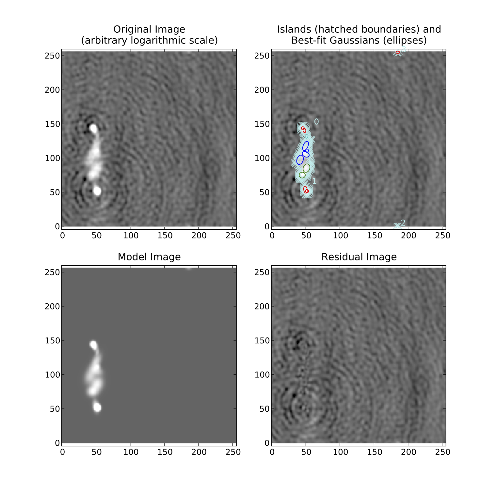

.. _basics:

*************
PyBDSM Basics
*************
PyBDSM has been designed to share many similarities with the CASA interactive environment (known as ``casapy`` [#f1]_ ), which is in turn based on AIPS. Therefore, the commands used in PyBDSM should be familiar to anyone who has used these software packages.

Starting PyBDSM
---------------
After installing (see :ref:`installing`) you can start PyBDSM by simply opening a terminal and typing::

    $ pybdsm

at the terminal prompt.

.. note::

    If the above command does not work, make sure you environment is initialized correctly for PyBDSM (see :ref:`add_to_path`).

The interactive environment will then load, and a welcome screen listing common commands and tasks will be shown. You will then be at the PyBDSM prompt, which looks like this::

    BDSM [1]:

Quitting PyBDSM
---------------
To quit PyBDSM, type ``quit`` or enter ``CNTL-D`` at the prompt.

Getting help
------------
PyBDSM has an extensive built-in help system. To get help on a command or task, type::

    help <command or task name>

For example, to get help on the ``process_image`` task, type::

    help process_image

To get help on a input parameter to a task, type::

    help '<parameter name>'

Note the quotes, which are necessary (since parameter names are strings). For example, to get help on the ``'rms_box'`` paramter, type::

    help 'rms_box'

Simply typing ``help`` will start the Python help system.

Logging
-------
Logging of all task output is done automatically to a log file. Logs for subsequent runs on the same image are appended to the end of the log file. The log for each run includes a listing of all the non-default and internally derived parameters, so that a run can be easily reproduced using only  information in the log.

.. _commands:

Commands
--------
As in CASA, PyBDSM uses a number of commands to list input parameters for tasks, to execute the tasks, etc. The PyBDSM commands are as follows:

.. parsed-literal::

    :term:`inp` task ............ : Set current task and list parameters
    :term:`go` .................. : Run the current task
    :term:`default` ............. : Set current task parameters to default values
    :term:`tput` ................ : Save parameter values
    :term:`tget` ................ : Load parameter values

.. glossary::
    inp
        This command sets the current task (e.g., ``inp process_image``) and lists the relevant parameters for that task. If entered without a task name, the parameters of the previously set task will be listed.

        .. note::

            At startup, the current task is set to the ``process image`` task.

    go
        This command executes the current task.

    default
        This command resets all parameters for a task to their default values.

        If a task name is given (e.g.,``default show_fit``), the
        parameters for that task are reset. If no task name is
        given, the parameters of the current task are reset.

    tput
        This command saves the processing parameters to a file.

        .. note::

            After the successful completion of a task, the current parameters are saved to the file 'pybdsm.last'.

        A file name may be given (e.g., ``tput 'savefile.sav'``), in which case the
        parameters are saved to the file specified. If no file name is given, the
        parameters are saved to the file 'pybdsm.last'. The saved parameters can be
        loaded using the :term:`tget` command.

    tget
        This command loads the processing parameters from a parameter save file.

        A file name may be given (e.g., ``tget 'savefile.sav'``), in which case the
        parameters are loaded from the file specified. If no file name is given,
        the parameters are loaded from the file 'pybdsm.last' if it exists.

        Normally, the save file is created by the :term:`tput` command.

Tasks
-----
The following tasks are available in PyBDSM:

.. parsed-literal::

    :term:`process_image` ....... : Process an image: find sources, etc.
    :term:`show_fit` ............ : Show the results of a fit
    :term:`write_catalog` ....... : Write out list of sources to a file
    :term:`export_image` ........ : Write residual/model/rms/mean image to a file

.. glossary::
    process_image
        This task processes an image to find and measure sources. See :ref:`process_image` for details.

    show_fit
        This task shows the result of a fit. See :ref:`showfit` for details.

    write_catalog
        This task writes the source catalog. See :ref:`write_catalog` for details.

    export_image
        This task exports an internally derived image. See :ref:`export_image` for details.

Hierarchy of an astronomical image
----------------------------------
The following figure shows the basic hierarchy of an image adopted by PyBDSM. Islands of emission are identified and decomposed into Gaussians. The Gaussians are then grouped into sources.

.. figure:: pybdsm_manual_dia.png
   :scale: 100 %
   :figwidth: 75 %
   :align: center
   :alt: image hierarchy

   The hierarchy of an image.

.. _quick_example:

Quick-start example
-------------------
Below is an example of using PyBDSM to find and measure sources in an image::

    $ pybdsm
    PyBDSM version 1.1 (LOFAR revision 20883)
    ========================================================================
    PyBDSM commands
      inp task ............ : Set current task and list parameters
      par = val ........... : Set a parameter (par = '' sets it to default)
                              Autocomplete (with TAB) works for par and val
      go .................. : Run the current task
      default ............. : Set current task parameters to default values
      tput ................ : Save parameter values
      tget ................ : Load parameter values
    PyBDSM tasks
      process_image ....... : Process an image: find sources, etc.
      show_fit ............ : Show the results of a fit
      write_catalog ....... : Write out list of sources to a file
      export_image ........ : Write residual/model/rms/mean image to a file
    PyBDSM help
      help command/task ... : Get help on a command or task
                              (e.g., help process_image)
      help 'par' .......... : Get help on a parameter (e.g., help 'rms_box')
      help changelog ...... : See list of recent changes
    ________________________________________________________________________

    BDSM [1]: inp process_image
    --------> inp(process_image)
    PROCESS_IMAGE: Find and measure sources in an image.
    =================================================================================
    filename ................. '': Input image file name
    advanced_opts ........ False : Show advanced options
    adaptive_rms_box ..... False : Use adaptive rms_box when determining rms and
                                   mean maps
    atrous_do ............ False : Decompose Gaussian residual image into multiple
                                   scales
    beam .................. None : FWHM of restoring beam. Specify as (maj, min, pos
                                   ang E of N) in degrees. E.g., beam = (0.06, 0.02,
                                   13.3). None => get from header
    flagging_opts ........ False : Show options for Gaussian flagging
    frequency ............. None : Frequency in Hz of input image. E.g., frequency =
                                   74e6. None => get from header.
    interactive .......... False : Use interactive mode
    mean_map .......... 'default': Background mean map: 'default' => calc whether to
                                   use or not, 'zero' => 0, 'const' => clipped mean,
                                   'map' => use 2-D map
    multichan_opts ....... False : Show options for multi-channel images
    output_opts .......... False : Show output options
    polarisation_do ...... False : Find polarisation properties
    psf_vary_do .......... False : Calculate PSF variation across image
    rms_box ............... None : Box size, step size for rms/mean map calculation.
                                   Specify as (box, step) in pixels. E.g., rms_box =
                                   (40, 10) => box of 40x40 pixels, step of 10
                                   pixels. None => calculate inside program
    rms_map ............... None : Background rms map: True => use 2-D rms map; False
                                   => use constant rms; None => calculate inside
                                   program
    shapelet_do .......... False : Decompose islands into shapelets
    spectralindex_do ..... False : Calculate spectral indices (for multi-channel
                                   image)
    thresh ................ None : Type of thresholding: None => calculate inside
                                   program, 'fdr' => use false detection rate
                                   algorithm, 'hard' => use sigma clipping
    thresh_isl ............. 3.0 : Threshold for the island boundary in number of
                                   sigma above the mean. Determines extent of island
                                   used for fitting
    thresh_pix ............. 5.0 : Source detection threshold: threshold for the
                                   island peak in number of sigma above the mean. If
                                   false detection rate thresholding is used, this
                                   value is ignored and thresh_pix is calculated
                                   inside the program

    BDSM [2]: filename = 'sb48.fits'
    BDSM [3]: go
    --------> go()
    --> Opened 'sb48.fits'
    Image size .............................. : (256, 256) pixels
    Number of channels ...................... : 1
    Beam shape (major, minor, pos angle) .... : (0.002916, 0.002654, -173.36) degrees
    Frequency of averaged image ............. : 146.497 MHz
    Blank pixels in the image ............... : 0 (0.0%)
    Flux from sum of (non-blank) pixels ..... : 29.565 Jy
    Derived rms_box (box size, step size) ... : (61, 20) pixels
    --> Variation in rms image significant
    --> Using 2D map for background rms
    --> Variation in mean image significant
    --> Using 2D map for background mean
    Min/max values of background rms map .... : (0.05358, 0.25376) Jy/beam
    Min/max values of background mean map ... : (-0.03656, 0.06190) Jy/beam
    --> Expected 5-sigma-clipped false detection rate < fdr_ratio
    --> Using sigma-clipping thresholding
    Number of islands found ................. : 4
    Fitting islands with Gaussians .......... : [====] 4/4
    Total number of Gaussians fit to image .. : 12
    Total flux in model ..................... : 27.336 Jy
    Number of sources formed from Gaussians   : 6

    BDSM [4]: show_fit
    --------> show_fit()

The figure made by ``show_fit`` is shown in the figure below. In the plot window, one can zoom in, save the plot to a file, etc. The list of best-fit Gaussians found by PyBDSM may be written to a file for use in other programs as follows::

    BDSM [5]: write_catalog
    --------> write_catalog()
    --> Wrote FITS file 'sb48.pybdsm.srl.fits'

The output Gaussian or source list contains source positions, fluxes, etc.

   Output of ``show_fit``, showing the original image with and without sources, the model image, and the residual (original minus model) image. Boundaries of the islands of emission found by PyBDSM are shown in light blue. The fitted Gaussians are shown for each island as ellipses (the sizes of which correspond to the FWHMs of the Gaussians). Gaussians that have been grouped together into a source are shown with the same color. For example, the two red Gaussians of island #1 have been grouped together into one source, and the nine Gaussians of island #0 have been grouped into 4 separate sources.

.. rubric:: Footnotes
.. [#f1] http://casa.nrao.edu
